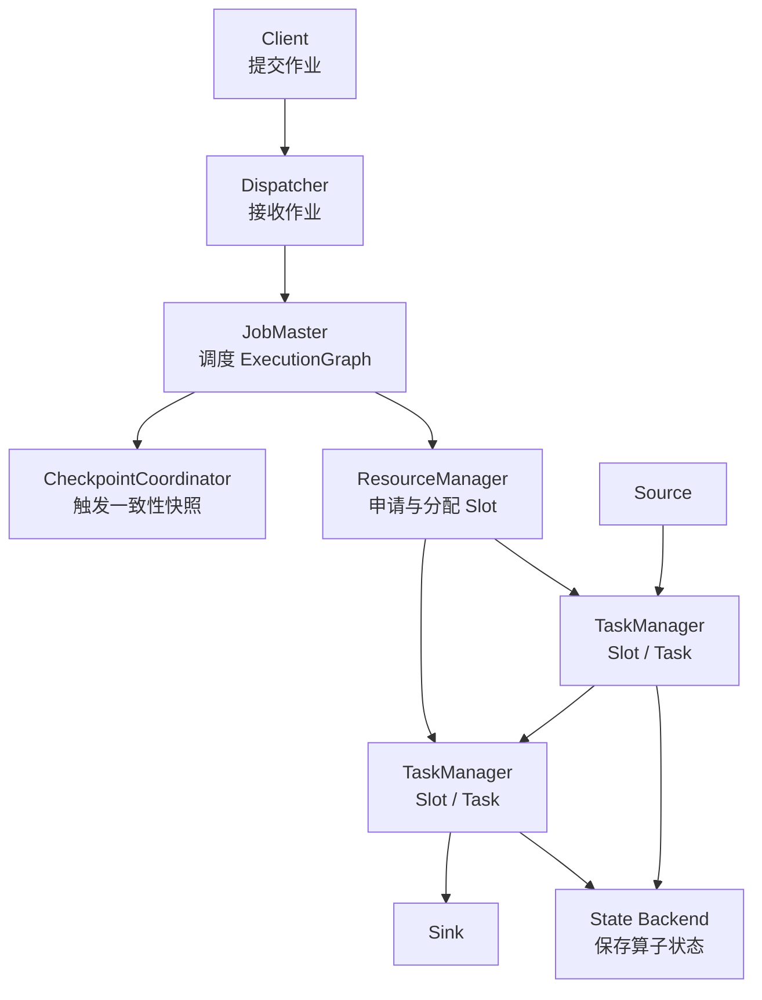

# Flink 架构概览

Flink 的运行时可以粗略分成客户端、集群资源管理、作业管理和任务执行几层。客户端提交 JobGraph，Dispatcher 接收作业并拉起对应的 JobMaster，JobMaster 负责调度和 checkpoint 协调，TaskManager 承载实际的并行 Task。

核心关系：

- Dispatcher 管作业生命周期入口，真正的单个作业调度由 JobMaster 负责。
- ResourceManager 管集群资源，TaskManager 提供 Slot。
- TaskManager 执行算子链，状态通过 State Backend 持久化。
- CheckpointCoordinator 由 JobMaster 驱动，用 barrier 对齐保证状态一致性。
